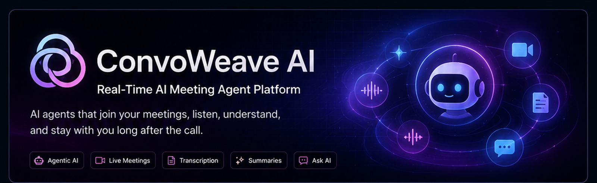
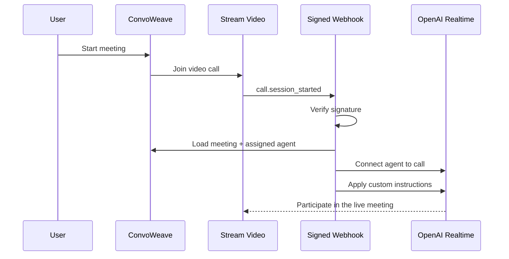
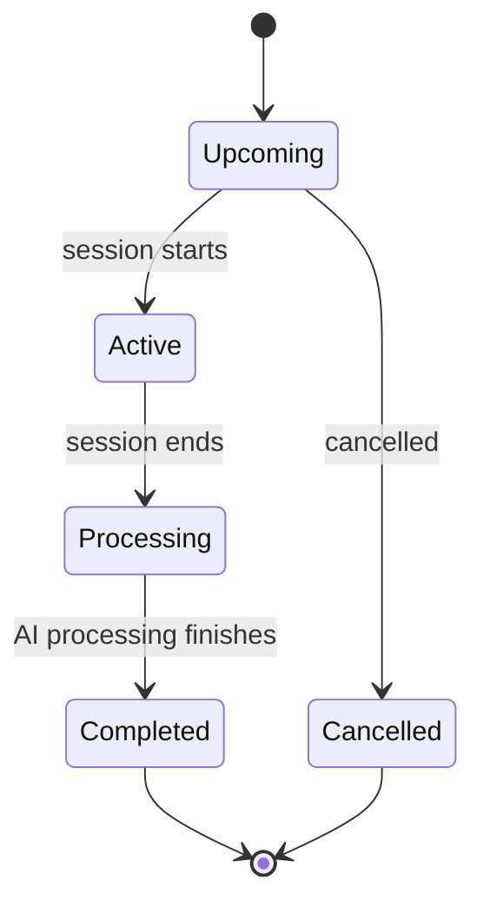
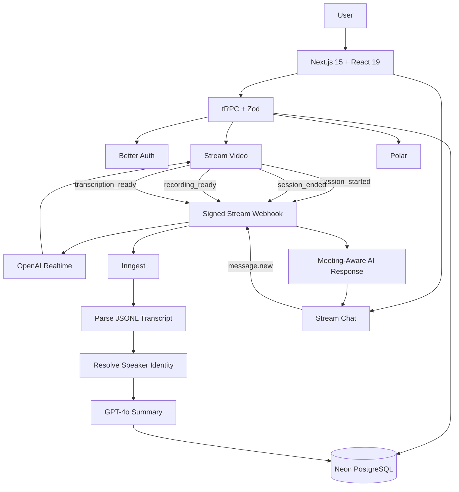

<div align="center">
  
</div>

<br/>

<div align="center">

# ConvoWeave AI

### Real-time AI meeting agents that participate during the call — and stay useful after it.

[](https://nextjs.org/)
[](https://react.dev/)
[](https://www.typescriptlang.org/)
[](https://openai.com/)
[](https://getstream.io/)
[](https://www.postgresql.org/)
[](https://orm.drizzle.team/)
[](https://trpc.io/)
[](https://www.inngest.com/)

**Custom AI agents · Live meetings · Recording · Transcription · Structured summaries · Transcript search · Post-meeting Ask AI**

</div>

---

## The idea

Most AI meeting tools become useful **after** the call.

ConvoWeave explores a different workflow:

> **Create an AI agent with its own instructions, bring it into a live meeting, then preserve the meeting context so the agent can continue helping after the call.**

The result is one continuous system spanning the live conversation and the post-meeting experience.

```text
Create AI Agent
      ↓
Create Meeting
      ↓
AI Joins Live Call
      ↓
Automatic Recording + Transcription
      ↓
Background Transcript Processing
      ↓
AI-Generated Summary
      ↓
Search Transcript + Replay Recording
      ↓
Continue with Ask AI
```

---

## ⚡ 30-second engineering overview

ConvoWeave is a full-stack AI SaaS project combining **real-time AI participation, event-driven backend workflows, relational data modeling, asynchronous processing, authentication, chat, and subscription-aware product controls**.

| Engineering area | What is implemented |
|---|---|
| **Agentic AI** | Users create reusable AI agents with custom behavioral instructions |
| **Real-time AI** | Assigned agents join Stream Video meetings through OpenAI Realtime |
| **Event-driven backend** | Signed Stream webhooks drive meeting lifecycle and post-call workflows |
| **Async AI processing** | Inngest fetches and parses transcripts, resolves speakers, and generates summaries |
| **Post-meeting intelligence** | Searchable transcript, recording playback, structured summary, and persistent Ask AI |
| **Full-stack product** | Next.js 15, React 19, TypeScript, tRPC, PostgreSQL/Neon, Drizzle |
| **Product controls** | Better Auth, OAuth, Polar subscriptions, and backend-enforced free-tier limits |

---

# ✨ Core experience

## 1. Create a reusable AI meeting agent

Each agent stores:

- a name,
- user-defined instructions,
- an owner,
- a persistent database identity.

Example agent behavior:

```text
Act as a technical interview coach.
Ask concise follow-up questions.
Challenge vague answers.
Help the user explain tradeoffs clearly.
```

Those instructions are applied to the live AI session when the meeting starts.

---

## 2. Bring the AI into a real video meeting

The application creates meetings through Stream Video with automatic transcription and recording enabled.

When Stream emits `call.session_started`, the backend:

1. verifies the webhook signature,
2. identifies the meeting,
3. moves it to `active`,
4. loads the assigned agent,
5. connects the Stream call to OpenAI Realtime,
6. applies that agent's instructions.



---

## 3. Track an explicit meeting lifecycle

Meetings are modeled as:



The PostgreSQL schema stores:

- meeting owner,
- assigned agent,
- status,
- start and end timestamps,
- transcript URL,
- recording URL,
- AI-generated summary.

---

## 4. Convert raw transcripts into useful meeting intelligence

When Stream reports that transcription is ready, ConvoWeave persists the transcript URL and emits an Inngest event.

The background workflow then:

```text
Fetch transcript
      ↓
Parse Stream JSONL
      ↓
Collect speaker IDs
      ↓
Resolve users + AI agents
      ↓
Rebuild speaker-aware transcript
      ↓
Generate GPT-4o summary
      ↓
Persist summary
      ↓
Meeting → completed
```

This keeps slower network and AI work outside the webhook request path.

---

## 5. Keep the meeting useful after the call

Completed meetings expose four views.

### 📝 Summary
An AI-generated Markdown summary is stored with the meeting and rendered in the dashboard.

### 🔎 Transcript
The transcript is reconstructed with speaker names and avatars and supports:

- keyword search,
- highlighted matches,
- timestamps.

### 🎥 Recording
The completed meeting view provides playback from the stored recording URL.

### 💬 Ask AI
The assigned agent continues helping through Stream Chat after the meeting.

For every new user message, the backend supplies the model with:

- the meeting summary,
- the agent's original instructions,
- recent conversation history.

The prompt explicitly tells the model to say when the stored meeting context is insufficient instead of inventing an answer.

---

# 🧠 System architecture



---

# 🔧 Engineering decisions

### Signed webhook verification

Incoming Stream webhooks are verified before meeting state is mutated or downstream AI processing begins.

### User-scoped application data

Meeting and agent read/update/delete procedures are scoped to the authenticated user. This keeps normal dashboard operations tied to the owning account.

### Typed application boundary

The application uses:

- **tRPC** for typed procedures,
- **Zod** for validation,
- **TanStack Query** for client data fetching,
- **Drizzle ORM** for typed relational access.

### Background processing

Transcript parsing and summarization run through **Inngest**, separating post-processing from interactive UI requests.

### Bounded post-meeting context

Ask AI is grounded in the persisted meeting summary, the agent's instructions, and recent chat history rather than an unconstrained prompt.

### Backend product limits

Polar customer/subscription state is used alongside backend procedures.

Current free-tier limits in the code:

```text
1 AI agent
3 meetings
```

---

# 🛠 Tech stack

| Layer | Technology |
|---|---|
| **Frontend** | Next.js 15, React 19, TypeScript, Tailwind CSS 4, shadcn/ui |
| **API & Data Fetching** | tRPC, Zod, TanStack Query |
| **Database** | PostgreSQL / Neon, Drizzle ORM |
| **Authentication** | Better Auth, Google OAuth, GitHub OAuth, email/password |
| **Live Video** | Stream Video |
| **Realtime AI** | OpenAI Realtime via Stream |
| **Post-meeting Chat** | Stream Chat |
| **AI Processing** | OpenAI, Inngest AgentKit |
| **Background Jobs** | Inngest |
| **Subscriptions** | Polar |
| **Generated Avatars** | DiceBear |

---

# 📁 Repository structure

```text
src/
├── app/
│   ├── (auth)/                 # Sign in / sign up
│   ├── (dashboard)/
│   │   ├── agents/             # AI agent management
│   │   ├── meetings/           # Meeting management
│   │   └── upgrade/            # Subscription UI
│   ├── api/
│   │   ├── auth/               # Better Auth
│   │   ├── inngest/            # Inngest endpoint
│   │   ├── trpc/               # tRPC endpoint
│   │   └── webhook/            # Stream event orchestration
│   └── call/[meetingId]/       # Live meeting experience
│
├── db/
│   ├── index.ts
│   └── schema.ts
│
├── inngest/
│   ├── client.ts
│   └── functions.ts            # Transcript → AI summary pipeline
│
├── lib/
│   ├── auth.ts
│   ├── polar.ts
│   ├── stream-chat.ts
│   └── stream-video.ts
│
├── modules/
│   ├── agents/
│   ├── auth/
│   ├── call/
│   ├── dashboard/
│   ├── meetings/
│   └── premium/
│
└── trpc/
```

---

# 🚀 Run locally

<details>
<summary><strong>1. Clone and install</strong></summary>

```bash
git clone https://github.com/Ankita2525/ConvoWeave-AI.git
cd ConvoWeave-AI
npm install
```

</details>

<details>
<summary><strong>2. Configure environment variables</strong></summary>

The codebase directly references:

```text
DATABASE_URL

GITHUB_CLIENT_ID
GITHUB_CLIENT_SECRET

GOOGLE_CLIENT_ID
GOOGLE_CLIENT_SECRET

NEXT_PUBLIC_APP_URL

OPENAI_API_KEY

NEXT_PUBLIC_STREAM_VIDEO_API_KEY
STREAM_VIDEO_SECRET_KEY

NEXT_PUBLIC_STREAM_CHAT_API_KEY
STREAM_CHAT_SECRET_KEY

POLAR_ACCESS_TOKEN
```

Your deployment may also require Inngest configuration according to the environment where the Inngest endpoint is hosted.

**Never commit real credentials or API keys.**

</details>

<details>
<summary><strong>3. Push the Drizzle schema</strong></summary>

```bash
npm run db:push
```

</details>

<details>
<summary><strong>4. Start development</strong></summary>

```bash
npm run dev
```

</details>

---

# ✅ Implemented today

- AI agent creation, editing, listing, and deletion
- custom agent instructions
- authenticated user accounts
- Google and GitHub OAuth
- email/password authentication
- meeting CRUD and filtering
- Stream Video meeting creation
- real-time OpenAI agent participation
- automatic recording
- automatic transcription
- signed Stream webhook handling
- meeting lifecycle transitions
- Inngest transcript-processing workflow
- speaker-aware transcript reconstruction
- GPT-4o meeting summaries
- transcript keyword search and highlighting
- recording playback
- persistent post-meeting Ask AI through Stream Chat
- Polar-backed subscription state
- backend-aware free usage limits

---

# 🧭 Next engineering steps

Some natural extensions of the current architecture:

- use the full transcript or retrieval over transcript chunks for richer Ask AI grounding,
- add structured action-item extraction,
- connect action items to calendar/task tools,
- add retry / failure-state handling for AI post-processing,
- build evaluation datasets for summary and post-meeting Q&A quality,
- add organization/team workspaces,
- add shared agent templates and libraries.

---

# Why **ConvoWeave AI**?

The product treats a meeting as more than a single video session.

It connects:

```text
Agent identity
      +
Live conversation
      +
Recording
      +
Transcript
      +
Summary
      +
Search
      +
Follow-up AI
```

into one continuous experience.

**The conversation ends. The context doesn't.**

---

<div align="center">

### Built by Ankita Khartmol

**AI/ML & Software Engineer · MS Computer Science, USC**

Agentic AI · Production ML systems · Full-stack AI products · Model evaluation

</div>
